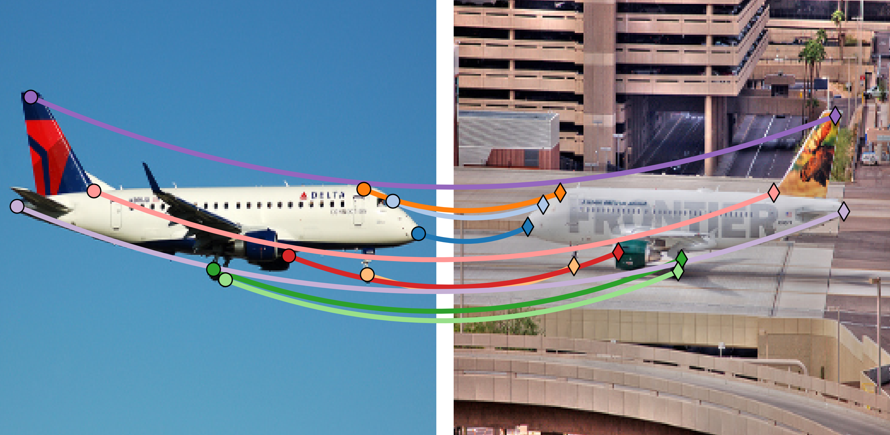
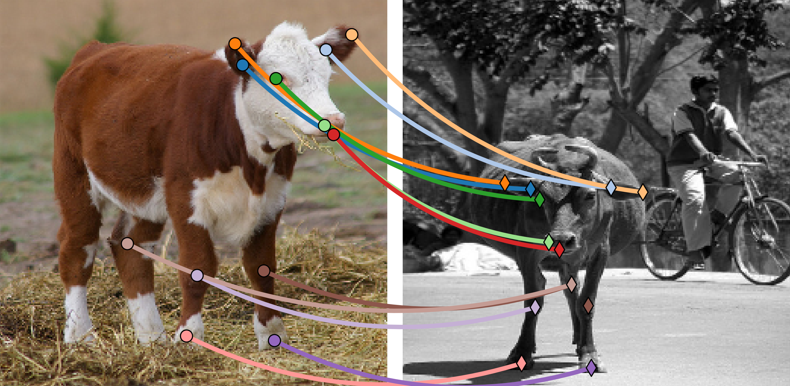

# Adaptive Edge Attention for Graph Matching with Outliers

Aeroplane | Cow | Train
:--:|:--:|:--:
 |  | 

This repository is the implementation of the paper: 

Jingwei Qu, Haibin Ling, Chenrui Zhang, Xiaoqing Lyu, and Zhi Tang. [Adaptive Edge Attention for Graph Matching with Outliers](https://doi.org/10.24963/ijcai.2021/134). *(IJCAI 2021)*

It contains the training and evaluation procedures for the three benchmarks in the paper:
* Pascal VOC with Berkeley annotations
* Willow Object
* CMU House Sequence

## Requirements
* **[Graph Nets](https://github.com/deepmind/graph_nets)** (TensorFlow 1 and Sonnet 1)
* **[PyTorch](https://pytorch.org/get-started/locally/)** (>= 1.2.0)

## Dataset
Download and prepare the datasets:
```bash
sh Data_Download.sh
```
Willow Object, CMU House Sequence, and Berkeley annotations of Pascal VOC are provided in the folder `data`.

## Evaluation
Run evaluation using the trained models provided in the folder `trained_models`:
```bash
sh Test_dataset.sh
```
where `dataset` is the benchmark to be evaluated (`PascalVOC`, `Willow`, or `CMUHouse`).

## Training
Run training:
```bash
sh Train_dataset.sh
```

## Citation
```text
@inproceedings{qu2021adaptive,
  title={Adaptive Edge Attention for Graph Matching with Outliers},
  author={Qu, Jingwei and Ling, Haibin and Zhang, Chenrui and Lyu, Xiaoqing and Tang, Zhi},
  booktitle={Proceedings of the International Joint Conference on Artificial Intelligence},
  pages={966--972},
  year={2021},
  doi={10.24963/ijcai.2021/134}
}
```
